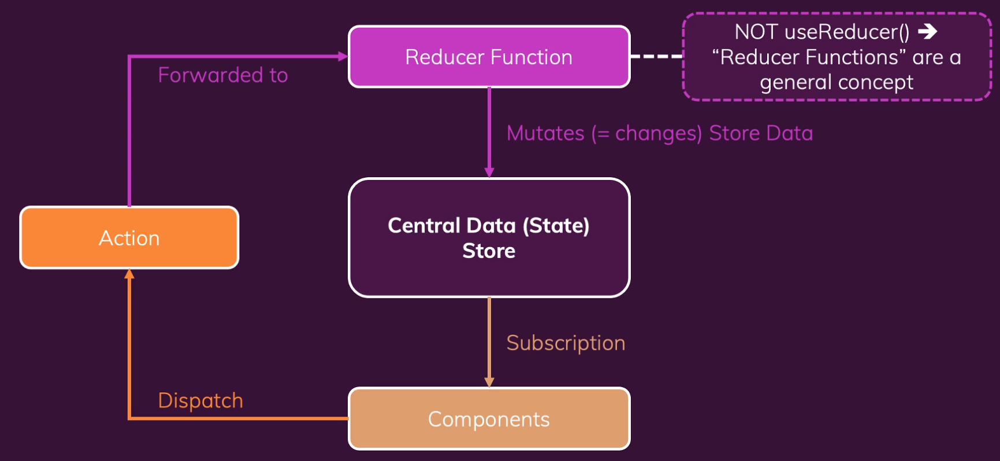

## About The Project

- React - The Complete Guide (incl Hooks, React Router, Redux)
- Dive in and learn React.js from scratch! Learn Reactjs, Hooks, Redux, React Routing, Animations, Next.js and way more!
- Tutorial for Redux Cart
- [Maximilian Schwarzmüller](https://github.com/maxschwarzmueller)
- [Academind](https://academind.com/)

&nbsp;

## Notes

- React Context Potential Disadvantages
  - <b>Complex setup/ Management: </b>Deeply nested JSC code and/ or many "Context Provider" components
  - <b>Performance: </b>Not optimized for high-frequency state changes

- [Redux - Prior Art](https://redux.js.org/understanding/history-and-design/prior-art)
  - Reducers must be pure, side-effect free, synchoronous functions
  - Input (Old State + Action) -> Output (New State)
  - Where should side-effects and async tasks be executed?
    - Inisde the components (e.g. useEffect())
    - Inside custom action creators

&nbsp;

- Fat reducers Vs Fat components Vs Fat actions
- Where should the logic be placed?
  - Synchronous, side-effect free code (i.e. data transformations)
    - Prefer Reducers
    - Avoid action creators or components
  - Async code or code with side-effects
    - Prefer action creators or components
    - Never use reducers

&nbsp;

---

&nbsp;

> <b>Vipin: </b>Why not components directly connect to the store to change data?

> <b>Prateek: </b>Well, we do interact with the state directly when we want some data from it. Redux architecture mostly is based on this action based approach. That when you interact with the interface, you essentially dispatch an action to get something done and meanwhile you continue with your other code.
>
> Another benefit is that dispatching an action comes under declarative style of programming. Here we just instruct what to do, like we say perform this action and here is the payload. We don't describe exactly in the component itself how everything should work. Just manage everything in your reducer which is directly in touch with store. Reducer wants your action and based on your type of action (meaning the thing you want - declarative mention) will decide the next state. Follow this recommended structure.

&nbsp;

---

&nbsp;
